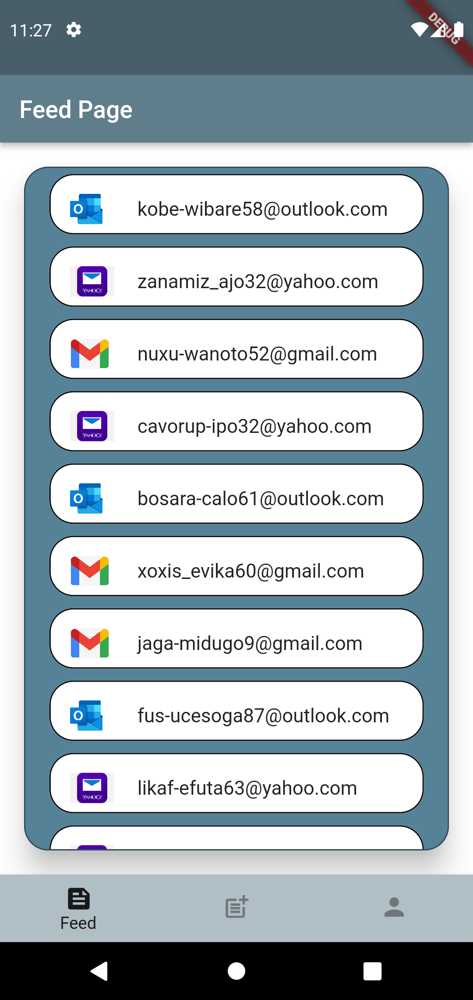
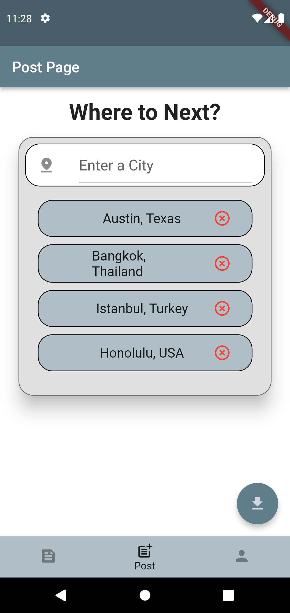
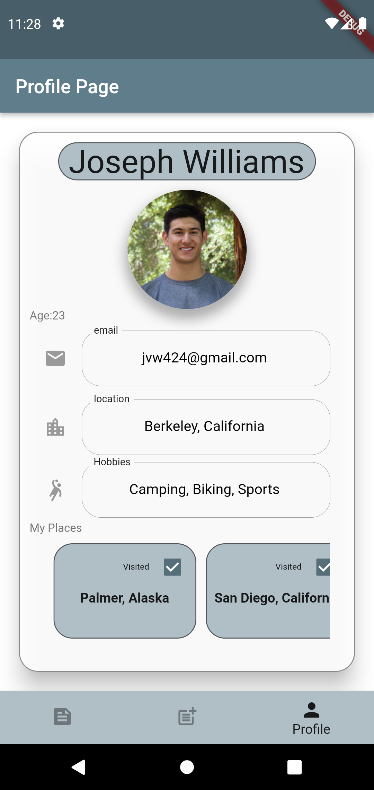

# Globe Sisters Task

## Post Page

* Adds desired location to a listview upon pressing enter on keyboard input
* Has a list of 100 suggested cities that updates suggestions as you type 
* You don not have to choose a suggested city you can type any location and press enter
* The floating action save button at the bottom clears the list it doesn't actually save response anywhere

## Profile Page
* Takes a User object as a parameter and builds a layout based on User features
* User class takes a birthday, a current location, an image path, a list of interests, a phone mumber, an email, a name, and a list of locations. 

## Feed Page

* Loads a list of emails and determines what image to display based on the email provided

)
)
